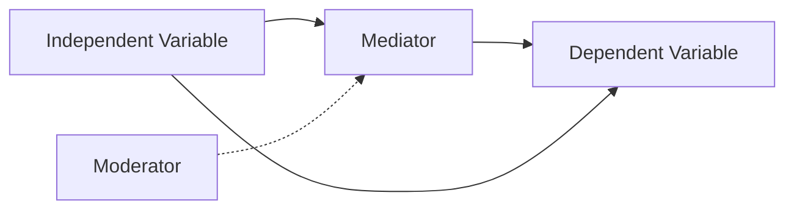

# Diagram Generator

Create a diagram for: **$ARGUMENTS**

## Spawn the `diagram-maker` agent for complex figures.

## Available Diagram Types

### 1. Conceptual Framework
Show relationships between theoretical concepts, variables, and constructs.

### 2. PRISMA Flow Diagram
Standard systematic review screening flowchart. Provide the numbers and the agent will generate the complete PRISMA 2020 flow diagram.

### 3. Research Design Overview
Visual representation of study methodology, data collection phases, and analysis pipeline.

### 4. Data Flow Diagram
How data moves through processing stages — from raw inputs to final outputs.

### 5. Timeline / Gantt
Project phases, milestones, and dependencies.

### 6. Taxonomy / Classification
Hierarchical organization of concepts, species, categories.

### 7. Cause-and-Effect (Fishbone/Ishikawa)
Root cause analysis diagrams.

### 8. Stakeholder Map
Relationships and influence between actors.

### 9. Decision Tree
Branching logic for methodology selection, diagnostic criteria, etc.

### 10. Comparison Table (APA formatted)
Structured tables following APA 7th formatting rules.

## Process
1. **Discuss** the purpose and content of the diagram with the human
2. **Draft** in Mermaid (preferred) or ASCII
3. **Review** with the human — iterate on layout and content
4. **Finalize** with proper figure numbering and caption

## Figure Formatting (APA 7th)
- Figure number: **Figure X** (bold)
- Title: *Descriptive title in italics*
- Caption below if needed
- Note: "Adapted from [source]" if based on existing work

## Rules
- Every diagram needs a clear purpose — don't visualize for the sake of it
- Keep it simple: if >15 elements, split into sub-diagrams
- Label everything — no ambiguous boxes or unlabeled arrows
- Ensure accessibility: don't rely solely on color to convey meaning
- For publication, note that Mermaid needs conversion to vector format (SVG/PDF)
