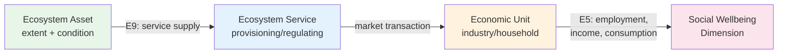
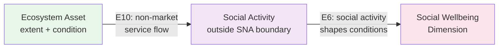
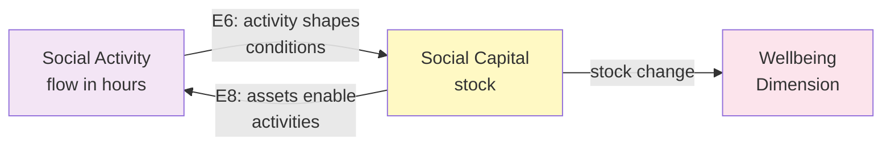
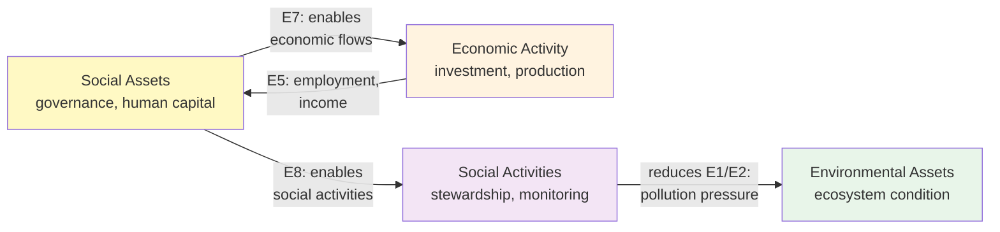
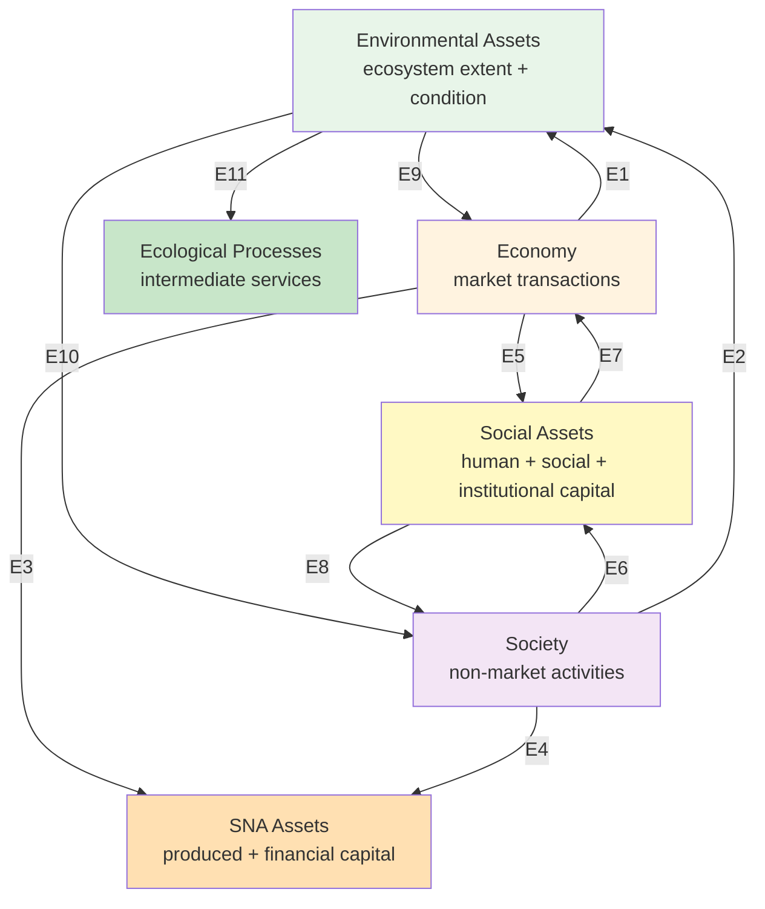

# Logic Chains: Ecosystem to Social Wellbeing

This document maps the directional connections between ecosystems, ecosystem services, the economy, and social wellbeing. Each chain is grounded in the 11-edge framework from GOAP TG-0.1 and uses the nested domain structure (Economy within Society within Environment).

## The nested domain structure

The Ocean Accounts Framework uses three nested domain groups for flows and three for stocks:

**Flow groups (nested):**
- FG1 (Economy): SNA production boundary -- monetary and physical flows, supply-use tables, household distributional accounts
- FG2 (Society, containing FG1): Everything in FG1 plus activities outside the SNA production boundary -- unpaid household labour, volunteering, customary practices, governance participation
- FG3 (Environment, containing FG2): Everything in FG2 plus ecological processes -- nutrient cycling, larval dispersal, carbon cycling

**Stock groups (nested):**
- SG1 (SNA assets): Produced and financial assets -- vessels, infrastructure, licences
- SG2 (Social assets, containing SG1): Everything in SG1 plus human capital, social capital, institutional capital, governance arrangements
- SG3 (Environmental assets, containing SG2): Everything in SG2 plus natural capital -- ecosystem assets (coral reefs, mangroves, fish stocks)

## Edges relevant to social accounts

Social accounts sit at the intersection of five edges:

| Edge | Direction | What it captures |
|---|---|---|
| E4 | FG2 to/from SG1 | Social activities affecting or drawing upon SNA assets (e.g., community use of public infrastructure) |
| E5 | FG1 to SG2 | Economic activities contributing to social conditions (e.g., employment generating livelihoods) |
| E6 | FG2 to SG2 | Social activities contributing to social conditions (e.g., volunteer networks building resilience) |
| E8 | SG2 to FG2 | Social assets enabling social activities (e.g., governance enabling community participation) |
| E10 | SG3 to FG2 | Ecosystem services flowing to society beyond market transactions (e.g., cultural values, subsistence provisioning) |

Two additional edges provide critical inputs:

| Edge | Direction | What it captures |
|---|---|---|
| E9 | SG3 to FG1 | Ecosystem services flowing to the economy (e.g., fish provisioning, coastal protection enabling economic activity) |
| E7 | SG2 to FG1 | Social assets enabling economic flows (e.g., governance creating investment conditions, educated workforce) |

---

## Chain A: Market pathway (Ecosystem to Economy to Social Wellbeing)

This is the primary pathway where ecosystem services enter the economy through market transactions and then affect social conditions through employment, income, and consumption.

**Direction:** SG3 to FG1 (E9), then FG1 to SG2 (E5)

### Worked examples

**Example A1: Fish provisioning to material wellbeing**

| Step | Domain | Measurement | Edge |
|---|---|---|---|
| Coral reef ecosystem | SG3 (Environmental asset) | 7,500 ha extent, 0.36 condition index | -- |
| Fish provisioning service | E9 flow | 61,000 kg/yr catch | E9 |
| Fishing industry revenue | FG1 (Economic flow) | 2.4M MVR/yr gross revenue | E3 |
| Fishing household income | FG1 to SG2 | 1.8M MVR/yr distributed to 450 households | E5 |
| Material wellbeing | SG2 (Social condition) | Income per fishing household: 4,000 MVR/yr | E5 |

**Example A2: Reef recreation to employment**

| Step | Domain | Measurement | Edge |
|---|---|---|---|
| Coral reef ecosystem | SG3 | Reef condition index 0.44 | -- |
| Recreation service | E9 flow | 45,000 visitor-trips/yr | E9 |
| Tourism industry activity | FG1 | 30.4M USD/yr tourism expenditure | E3 |
| Tourism employment | FG1 to SG2 | 1,200 jobs (680 formal, 520 informal) | E5 |
| Employment wellbeing | SG2 | Employment rate in ocean sector: 34% of coastal workforce | E5 |

**Example A3: Fish provisioning to food security**

| Step | Domain | Measurement | Edge |
|---|---|---|---|
| Reef + pelagic ecosystem | SG3 | Combined fish stock biomass | -- |
| Fish provisioning | E9 flow | 61,000 kg/yr total catch | E9 |
| Market distribution + subsistence | FG1 + FG2 | 40,000 kg to market, 21,000 kg subsistence | E9, E10 |
| Household fish consumption | FG1/FG2 to SG2 | 42 kg/capita/yr (national avg) | E5 |
| Food security | SG2 | Proportion of protein from marine sources: 65% | E5 |

---

## Chain B: Non-market pathway (Ecosystem to Social Wellbeing directly)

This pathway captures ecosystem services that benefit society without passing through market transactions. These services flow directly from the environment to the social domain.

**Direction:** SG3 to FG2 (E10), then FG2 to SG2 (E6)

### Worked examples

**Example B1: Coastal protection to community resilience**

| Step | Domain | Measurement | Edge |
|---|---|---|---|
| Mangrove + coral reef ecosystem | SG3 | 18.7 ha mangrove, 7,500 ha reef | -- |
| Coastal protection service | E10 flow | 778 buildings protected, 12 km coastline buffered | E10 |
| Community safety (non-market) | FG2 to SG2 | Avoided storm damage: 2.1M USD equivalent | E6 |
| Health + housing security | SG2 | % households in flood zone with ecosystem protection: 89% | E6 |

**Example B2: Marine cultural services to cultural wellbeing**

| Step | Domain | Measurement | Edge |
|---|---|---|---|
| Reef + coastal ecosystem | SG3 | Culturally significant marine sites | -- |
| Cultural/spiritual service | E10 flow | Access to sacred marine sites, traditional fishing grounds | E10 |
| Cultural practice activity | FG2 | 4,200 hours/yr traditional ceremonies, 8,500 hours/yr traditional fishing | E6 |
| Cultural wellbeing | SG2 | Intergenerational knowledge transmission active: 72% of communities | E6 |

**Example B3: Subsistence provisioning to food security**

| Step | Domain | Measurement | Edge |
|---|---|---|---|
| Seagrass ecosystem | SG3 | 5,000 ha seagrass beds | -- |
| Gleaning service | E10 flow | 3,960 hours/yr, 227 gleaners | E10 |
| Subsistence food (outside SNA) | FG2 to SG2 | 8,400 kg shellfish + seaweed for household consumption | E6 |
| Food security | SG2 | % food-insecure households with marine subsistence access: 78% | E6 |

---

## Chain C: Social activity pathway (Social Flows to Social Stocks)

This pathway captures how social activities (flows measured in hours) create, maintain, or change social conditions (stocks). It operates within the social domain itself.

**Direction:** FG2 to SG2 (E6) and SG2 to FG2 (E8) -- a feedback loop

### Worked examples

**Example C1: Governance participation to institutional capital**

| Step | Domain | Measurement | Edge |
|---|---|---|---|
| Community fisheries management meetings | FG2 (social activity flow) | 2,400 hours/yr across 15 communities | E6 |
| Institutional capital (stock change) | SG2 | Co-management agreements: 3 (opening) to 5 (closing) | E6 |
| Equity outcome | SG2 | % communities with formal voice in resource allocation: 60% to 80% | -- |

**Example C2: Knowledge sharing to human capital**

| Step | Domain | Measurement | Edge |
|---|---|---|---|
| Traditional ecological knowledge sharing | FG2 (social activity flow) | 1,800 hours/yr mentoring young fishers | E6 |
| Human capital (stock change) | SG2 | Fishers with traditional navigation skills: 45 (opening) to 52 (closing) | E6 |
| Cultural wellbeing | SG2 | Intergenerational knowledge continuity index: 0.62 to 0.68 | -- |

**Example C3: Unpaid household labour enabling ocean work**

| Step | Domain | Measurement | Edge |
|---|---|---|---|
| Childcare enabling fishing | FG2 (social activity flow) | 12,000 hours/yr across fishing households | E6 |
| Fishing industry output | FG1 | Enabled fishing effort: 8,000 person-days/yr | E8 to E7 |
| Gender equity | SG2 | % of unpaid ocean-enabling labour by women: 87% | -- |

---

## Chain D: Feedback loops (Social Assets Enabling Economic and Environmental Outcomes)

Social conditions are not just endpoints. They feed back into economic activity and environmental management.

### Worked example: Governance improving ecosystem management

| Step | Domain | Measurement | Edge |
|---|---|---|---|
| MPA governance framework | SG2 (institutional capital) | 3 MPAs covering 15% of territorial waters | -- |
| Enables community monitoring | SG2 to FG2 | 1,200 volunteer hours/yr patrol and monitoring | E8 |
| Reduces illegal fishing pressure | FG2 to SG3 | Poaching incidents: 45/yr to 18/yr | reduces E1 |
| Fish stock recovery | SG3 | Fish biomass index: 180 to 220 kg/ha | -- |
| Increased fish provisioning | SG3 to FG1 | Sustainable catch increases 12% | E9 |
| Higher fishing income | FG1 to SG2 | Household income from fishing: +8% | E5 |

---

## Summary: Complete edge map for social accounts

### Which edges each social dimension depends on

| Social dimension | Primary edges | Secondary edges | Type of chain |
|---|---|---|---|
| Material wellbeing | E9, E5 | E3 | Market (Chain A) |
| Employment | E9, E5 | E7 | Market (Chain A) |
| Food security | E9, E10, E5 | E6 | Market + Non-market (Chain A + B) |
| Health | E10, E5, E6 | E1, E2 | Mixed |
| Cultural/spiritual | E10, E6 | E8 | Non-market (Chain B + C) |
| Recreation | E9, E10 | E5, E6 | Mixed |
| Environmental quality | E1, E2, E10 | E6 | Non-market (Chain B) |
| Equity (cross-cutting) | E5, E6 | E7, E8 | All chains |
| Vulnerability (cross-cutting) | E9, E10, E5, E6 | E7, E8 | All chains |

---

## Open questions

1. **Double-counting risk:** Fish provisioning appears in both Chain A (market, E9) and Chain B (subsistence, E10). The physical flow (kg of fish) must be allocated to one chain or the other, not both. The SNA production boundary determines the split: fish sold at market is E9; fish consumed by the catching household is E10 (outside production boundary) or E9 (if treated as production for own final use under SNA 2025).

2. **Temporal alignment:** Ecosystem condition changes slowly (years to decades). Social conditions change at different rates -- employment can shift in months, cultural knowledge erodes over generations. How do accounting periods align?

3. **Attribution:** When fishing household income improves, how much is attributable to ecosystem condition (more fish) versus economic conditions (higher prices) versus social conditions (better governance enabling access)? The multi-edge framework describes these as separate flows but disentangling them empirically is difficult.

4. **Feedback strength:** Chain D shows social assets feeding back to environmental outcomes, but the strength and timing of these feedbacks are poorly quantified. Is this a conceptual relationship or something that can be measured in accounting tables?
